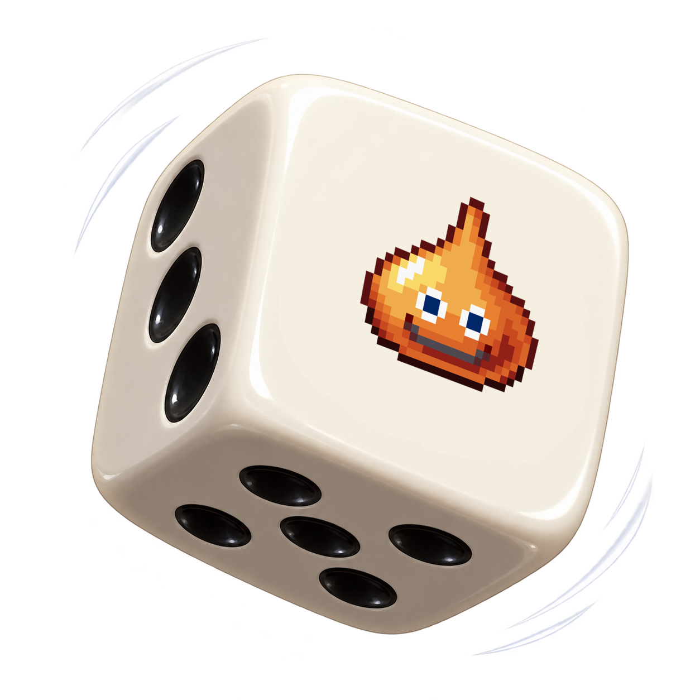

# DQMJ3P Randomizer

[English](#english) · [Italiano](#italiano)

<p align="center">
  <a href="https://github.com/Lurpigi/DQMJ3P-Randomizer/releases/latest">
    
  </a>
  <a href="https://github.com/Lurpigi/DQMJ3P-Randomizer/releases/latest/download/dqmj3p_randomizer_portable.zip">
    
  </a>
</p>

<p align="center">
  
</p>

## English

A small randomizer for *Dragon Quest Monsters: Joker 3 Professional*. Pick a seed to replace encounter monsters while keeping their size. Use the same seed and options to get the same results again.

For the English fan patch, see [DQMJ3P English Fixed](https://github.com/Akoi89/DQMJ3P-english-fixed).

### Get the RomFS folders

The app needs the extracted RomFS from the base game and update 1.3. Use [HackingToolkit3DS v9](https://github.com/Asia81/HackingToolkit9DS/releases/tag/9) to extract the game and update files separately. When asked about `code.bin`, choose **No**. Keep the two `ExtractedRomFS` folders separate and select each folder that contains `data/`. See the [full guide](docs/INSTALL.md#english).

### 🚀 Start

You need Python 3.10 or later with Tkinter. From the program folder, run:

```powershell
python randomizer_app.py
```

The app does not include game files and does not open CIA or 3DS files. Select the already extracted RomFS folders for the base game and update 1.3. The app combines them while it runs, with update files taking precedence. Keep the app folder together when you move it.

Choose **IT** or **EN** in the top-right corner to switch the app language.

### 🎲 Make a package

1. Enter a seed. Use `0` to get a random one.
2. Choose the families and ranks allowed for replacements. The filters apply together and do not change which original monsters are randomized.
3. Open **Advanced options**. Hover over **ⓘ** for details.
4. Optional: select **Use event and boss species as replacements**.
5. Optional: select **Also change records outside wild encounters (experimental)**.
6. Select the base game RomFS folder and the update 1.3 RomFS folder.
7. Create the package. Find the folder and ZIP in `output/`.

The same seed and options always assign the same replacement to each battle record. Encounters of the same species can differ if they use different records. Encounters that share a record keep the same replacement.

The package contains the modified files, a manifest, a spoiler file, a configuration file, and an installation guide. The app checks both selected folders before creating it. Source game files are not included in the app download.


### ⌨️ Use the command line

```powershell
python randomize.py --base-romfs "C:\path\to\base-romfs" --update-romfs "C:\path\to\update-romfs" --seed 42
python randomize.py --base-romfs "C:\path\to\base-romfs" --update-romfs "C:\path\to\update-romfs" --seed 42 --include-special-donors --include-nonwild-instances
python randomize.py --base-romfs "C:\path\to\base-romfs" --update-romfs "C:\path\to\update-romfs" --seed 42 --family slime --family material
python randomize.py --base-romfs "C:\path\to\base-romfs" --update-romfs "C:\path\to\update-romfs" --seed 42 --family slime --rank f --rank ss
```

The randomizer assigns replacements by battle record. Run `python randomize.py --help` to see all options. For installation, see [INSTALL.md](docs/INSTALL.md#english). For technical details, see [FORMAT.md](docs/FORMAT.md#english).

### 📚 Guides

- [Install the mod](docs/INSTALL.md#english)
- [File formats and technical details](docs/FORMAT.md#english)

### 💬 Community

Join the [DQMJ3P Discord server](https://discord.com/invite/W5yRJpDd5e).

## Italiano

Un piccolo randomizer per *Dragon Quest Monsters: Joker 3 Professional*. Scegli un seed per sostituire i mostri degli incontri mantenendone la taglia. Usa lo stesso seed e le stesse opzioni per ottenere di nuovo gli stessi risultati.

### Ottieni le cartelle RomFS

L'app richiede il RomFS estratto del gioco base e dell'aggiornamento 1.3. Usa [HackingToolkit3DS v9](https://github.com/Asia81/HackingToolkit9DS/releases/tag/9) per estrarre separatamente i file del gioco e dell'update. Quando ti chiede se decomprimere `code.bin`, scegli **No**. Tieni separate le due cartelle `ExtractedRomFS` e seleziona ciascuna cartella che contiene `data/`. Leggi la [guida completa](docs/INSTALL.md#italiano).

### 🚀 Avvio

Serve Python 3.10 o versioni successive con Tkinter. Dalla cartella del programma, esegui:

```powershell
python randomizer_app.py
```

L'app non include file di gioco e non apre file CIA o 3DS. Seleziona le cartelle RomFS già estratte del gioco base e dell'aggiornamento 1.3. L'app le combina mentre è in esecuzione e dà precedenza ai file dell'update. Quando sposti l'app, conserva tutta la cartella.

Scegli **IT** o **EN** in alto a destra per cambiare la lingua dell'app.

### 🎲 Crea un pacchetto

1. Inserisci un seed. Usa `0` per generarne uno casuale.
2. Scegli le famiglie e i gradi ammessi per i sostituti. I filtri si applicano insieme e non cambiano quali mostri originali vengono randomizzati.
3. Apri **Opzioni avanzate**. Passa il puntatore su **ⓘ** per i dettagli.
4. Facoltativo: seleziona **Usa specie di eventi e boss come sostituti**.
5. Facoltativo: seleziona **Modifica anche i record fuori dagli incontri selvatici (sperimentale)**.
6. Seleziona la cartella RomFS del gioco base e quella dell'aggiornamento 1.3.
7. Crea il pacchetto. Trovi la cartella e il file ZIP in `output/`.

Lo stesso seed e le stesse opzioni assegnano sempre lo stesso sostituto a ogni record di battaglia. Incontri della stessa specie possono essere diversi se usano record diversi. Gli incontri che condividono un record mantengono lo stesso sostituto.

Il pacchetto contiene i file modificati, un manifest, uno spoiler, una configurazione e una guida all'installazione. Prima di crearlo, l'app controlla entrambe le cartelle selezionate. Il download dell'app non contiene file di gioco.


### ⌨️ Usa la riga di comando

```powershell
python randomize.py --base-romfs "C:\percorso\romfs-base" --update-romfs "C:\percorso\romfs-update" --seed 42
python randomize.py --base-romfs "C:\percorso\romfs-base" --update-romfs "C:\percorso\romfs-update" --seed 42 --include-special-donors --include-nonwild-instances
python randomize.py --base-romfs "C:\percorso\romfs-base" --update-romfs "C:\percorso\romfs-update" --seed 42 --family slime --family material
python randomize.py --base-romfs "C:\percorso\romfs-base" --update-romfs "C:\percorso\romfs-update" --seed 42 --family slime --rank f --rank ss
```

Il randomizer assegna i sostituti in base al record di battaglia. Esegui `python randomize.py --help` per vedere tutte le opzioni. Per l'installazione, consulta [INSTALL.md](docs/INSTALL.md#italiano). Per i dettagli tecnici, consulta [FORMAT.md](docs/FORMAT.md#italiano).

### 📚 Guide

- [Installa la mod](docs/INSTALL.md#italiano)
- [Formati e dettagli tecnici](docs/FORMAT.md#italiano)

### 💬 Comunità

Entra nel [server Discord di DQMJ3P](https://discord.com/invite/W5yRJpDd5e).

